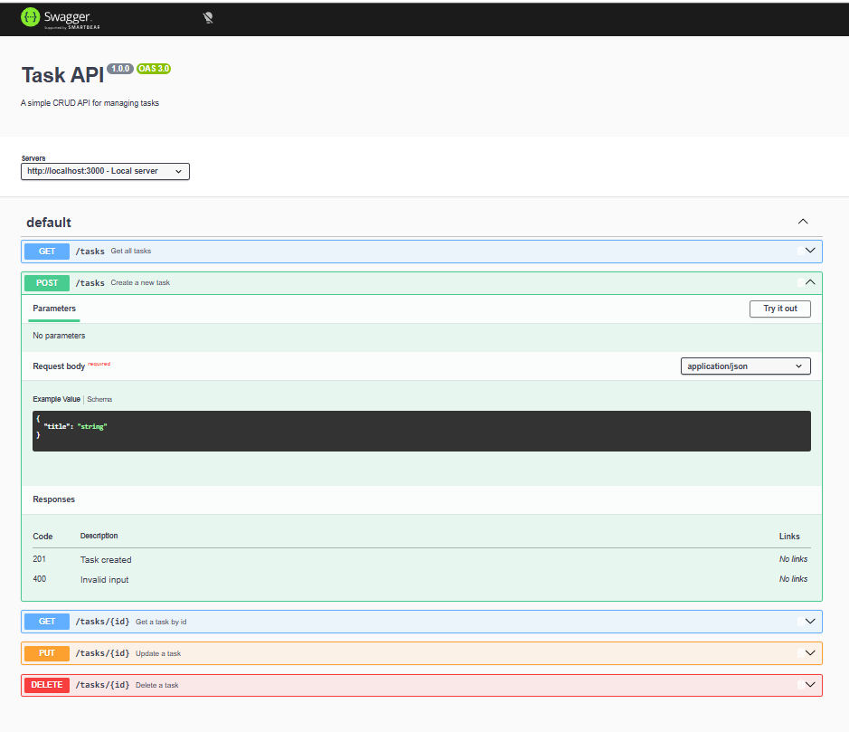

Readme · MD
# Task API
 
A simple CRUD API for managing tasks, built with Node.js and Express as part of the FlyRank Internship — Backend Track.

 <
## Features
 
- Create, read, update, and delete tasks
- In-memory storage (no database yet — see note below)
- Input validation with proper HTTP status codes
- Layered architecture separating HTTP handling, business logic, and data access
## Tech Stack
 
- Node.js
- Express
## Getting Started
 
```bash
npm install
npm start
```
 
Server runs on `http://localhost:3000` by default.
 
## Endpoints
 
| Method | Endpoint      | Description                     |
|--------|---------------|----------------------------------|
| GET    | `/`           | API info                        |
| GET    | `/health`     | Health check                    |
| GET    | `/tasks`      | List all tasks                  |
| GET    | `/tasks/:id`  | Get a single task                |
| POST   | `/tasks`      | Create a task (`{ title }`)      |
| PUT    | `/tasks/:id`  | Update a task (`title` and/or `done`) |
| DELETE | `/tasks/:id`  | Delete a task                   |
 
## Project Structure
 
```
task-api/
├── src/
│   ├── server.js       # App entry point — Express setup, middleware, mounts routes
│   ├── route.js        # HTTP layer — parses requests, calls the service, returns responses
│   ├── service.js       # Business logic — validation, decides what counts as a valid request
│   └── repository.js   # Data access — owns the actual data and how it's stored/retrieved
├── package.json
└── README.md
```
 
## Why Layered Architecture?
 
The first working version of this API had everything — server setup, routes, validation, and data storage — in a single file. It worked, but it doesn't scale well as an assignment or a real project:
 
- **Hard to test.** You can't easily test "is this title valid?" without also spinning up an HTTP server.
- **Hard to change.** A small change (like adding a new validation rule) risks breaking unrelated code because everything is tangled together.
- **Hard to read.** As more endpoints get added, one file turns into a wall of code with no clear boundaries.
So the code is split into three layers, each with one job:
 
1. **Route layer (`route.js`)** — Only knows about HTTP. It reads `req.params` / `req.body`, calls the service layer, and turns the result into a status code + JSON response. It contains no business rules.
2. **Service layer (`service.js`)** — Contains the actual rules: is a title required? Is `done` a boolean? What happens if nothing is found? This layer doesn't know or care that HTTP exists — it just returns data or an error.
3. **Repository layer (`repository.js`)** — The only place that knows *how* data is stored. Right now that's a plain in-memory array, but it could just as easily be a real database.
### The key benefit
 
Because the repository layer is the only place that touches the actual data storage, **swapping the in-memory array for a real database (e.g. PostgreSQL or MongoDB) only requires changes inside `repository.js`.** The service and route layers stay exactly the same, since they only ever talk to the repository through its function names (`findAll`, `findById`, `create`, `update`, `remove`) — not through how those functions are implemented.
 
This is the core idea of **separation of concerns**: each layer has one responsibility, so a change in one place doesn't ripple through the whole codebase.
 
## Known Limitation
 
Data is stored in memory, so it resets every time the server restarts. This is intentional at this stage — the next step is to replace `repository.js` with a real database connection, which the layered structure is specifically designed to make painless.
 ## Sample curl Output

Request: `GET /tasks`

```
$ curl.exe -i http://localhost:3000/tasks
HTTP/1.1 200 OK
X-Powered-By: Express
Content-Type: application/json; charset=utf-8
Content-Length: 139
ETag: W/"8b-LNFY3dXWI924YRL/+rEeoz7/4m8"
Date: Sat, 12 Sep 2026 10:23:22 GMT
Connection: keep-alive
Keep-Alive: timeout=5

[{"id":1,"title":"Buy milk","done":false},{"id":2,"title":"Walk the dog","done":true},{"id":3,"title":"Finish W2 assignment","done":false}]
```

